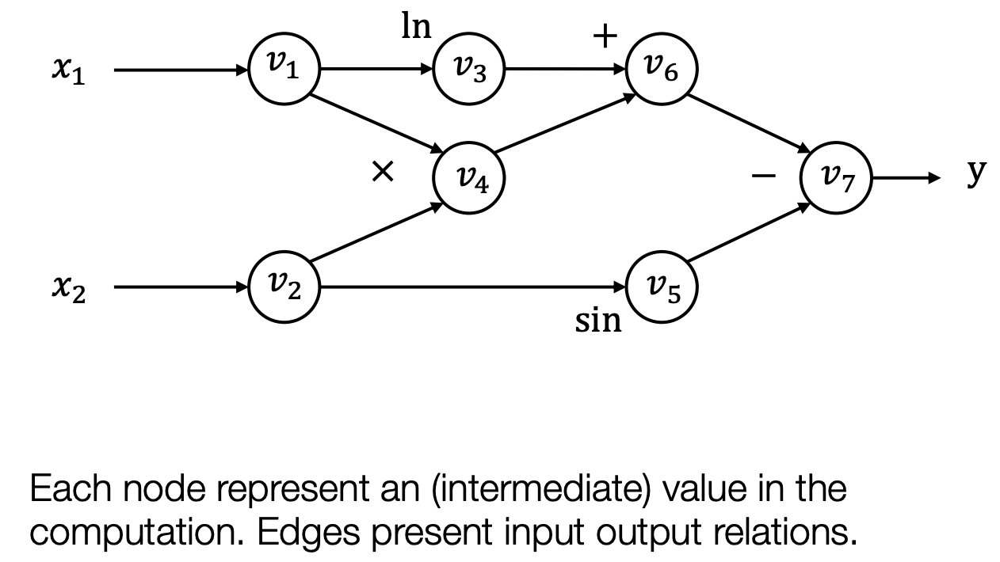

## 序

这篇文章是[CMU 10-414/714](https://dlsyscourse.org/)的学习笔记第一篇。主要概括课程前5讲的内容。我感觉前五讲中的重点如下，欢迎大家评论补充。

1. 机器学习系统的基本框架(Framework)
2. 自动微分(Automatic Differentiation)及其实现细节

在整个笔记系列的最前面，补充一点我的个人看法：我认为这门课是一门非常 engineering 的课程。机器学习系统其实是支持机器学习飞速发展的一个很重要的工具，正因为Pytorch 提供了非常完善的 API，刚刚学习 Python 几天的人就可以搭建属于自己的神经网络；也正是因为 MLSystem 让idea 的实现变得足够的简单，才会有更多的人愿意实现、测试自己的 idea，进而会涌现出更好的 idea。

## Machine Learning Framework


上图包含了机器学习的主体流程以及主体模块:`hypothesis class, loss function, optimizer`。

- `hypothesis class`具体到代码中就是`nn.Module class`。对于给定的输入，该模块可以计算输出。一般这个模块中会包含一些训练参数。这里值得一提的是，如何初始化这些训练参数是非常重要的，但考虑到这个不是 engineer 该考虑的东西，其笔记我会放在附录。
- `loss function`: 用于评估当前训练参数的优劣。
- `optimizer`: 用于更新训练参数。其中会记录一些辅助的参数，例如Adam 中会记录 optimizer 的梯度的动量(momentum)。
- 另一些模块不是本次课程的重点，但是在作业里会用到。例如`Dataloader`的作用就是用于生成训练数据的，而`shuffle`和`Data Augmentation` 则是其中非常重要的一部分。

本次课程的目的就是让我们能从头开始构建一个简单版本的Machine Learning Framework，上面图中的每个类我们都会写一个自己的版本。

## Neural Network Framework and Automatic Differentiation

这小节的目标是写一个自己的神经网络类，以此来搞清楚 pytorch 中`nn.Module`背后的逻辑。在实现神经网络的时候，我们不仅需要写前向计算(forward)，还需要写反向计算(forward)。为了前向计算(或者说，为了进行计算)，我们引入计算图这个概念，计算图可以将复杂的计算拆解成很多简单的计算；为了进行反向转播，我们会使用自动微分(Automatic Differentiation)来帮我们计算梯度。

### 计算图



上图是$\mathrm{y}=\mathrm{f}\left(x_1, x_2\right)=\ln \left(x_1\right)+x_1 x_2-\sin x_2$ 的计算图。这是一个很复杂的计算公式，但是这个公式是由很多简单的基本运算组成的。我们将每个数字亦或是中间变量视为一个节点，运算视为边，那么整个计算公式就是一个有向无环图。如果是二元运算，比如加法，一个运算会对应两条边。

事实上前向计算的主体部分就是这样。我们实现一个又一个的算子，通过组合算子得到最终的模型。

### Automatic Differentiation

基于 graph，有两种方式计算梯度。这里主要介绍现代框架(pytorch, tensorflow)采用的方式 Reverse AD(Reverse mode AD by extending computational graph)，即我们会在反向计算的时候创建一个新的用于计算梯度的计算图。

### 实现

数据结构的伪代码如下所示。前向计算的逻辑很简单，如果是计算当前 Value 的值了，那么先递归的计算inputs 里的 Value；反向传播则需要用到拓扑排序，因为必须先计算拓扑排序靠后节点的梯度，才能计算拓扑排序中靠前节点的梯度。

hw1 就是要求我们实现一些常见算子的前向计算以及反向传播，以及实现整个框架的 Reverse AD 算法。hw1 还要求实现 softmax loss 的梯度计算以及 SGD, 但是 softmax loss 的计算最难是推导(推荐结果见附录)，在有数学结果的前提下写代码非常轻松；SGD 也不涉及动量的计算，因此不放在本文中讲。(开始给自己挖坑啦，希望我真的能把这个系列写完 orz)

在做 hw4 的时候感觉遇到了一些小坑。因为做 hw1 的时候，Value 中的 `cached_data` 的类型是 numpy.ndarray，而 hw4 的时候，Value 中的`cached_data` 的类型是自己实现的 NDArray，这二者的接口是有差异的，所以 hw1 能跑通的代码 hw4 不一定能跑通。当然我们是要以 hw4 为准的，因为 NDArray 这么重要的模块，接口必须由自己来定义。只是做作业的时候，hw1 做的有多开心，hw4 debug 就有多卑微。

```python
class Value:
    op: Optional[Op]
    inputs: List["Value"]
    cached_data: NDArray 
    
class Op:
    def __call__(self, *args)
    def compute(self, *args: Tuple[NDArray]):
    def gradient(
        self, out_grad: "Value", node: "Value"
    ) -> Union["Value", Tuple["Value"]]:
```

## 附录: Lec1-Lec5的 PPT 笔记

- [Lec1 - introduction](https://dlsyscourse.org/slides/intro.pdf): 为什么要学习这门课程。
- [Lec2 - ML Basic](https://dlsyscourse.org/slides/softmax_regression.pdf): 介绍了 Machine Learning 的三个基本组成部分: hypothesis class, loss function, optimizer. 并以 softmax regresssion 为例，介绍了 cross-entropy loss 和 sgd optimization. 这里介绍的一个求导的方法我很喜欢: "Pretend everything is a scalar, use the typical chain rule, and then rearrange /
transpose matrices/vectors to make the sizes work". 下面是 Cross Entropy 的公式以及其求导结果。
$$
\ell_{c e}(h(x), y)=-\log p(\text { label }=y)=-h_y(x)+\log \sum_{j=1}^k \exp \left(h_j(x)\right) \\
\nabla_X \ell_{c e}(X, y) \in \mathbb{R}^{n \times k}=\left(Z-I_y\right), \quad Z= \text{normalize}(\exp (X))
$$
- [Lec3](https://dlsyscourse.org/slides/manual_neural_nets.pdf): 简单介绍了什么是神经网络，可以跳过。
- [Lec4-5 - Automatic Differentiation](https://dlsyscourse.org/slides/4-automatic-differentiation.pdf): 自动微分的原理以及实现，具体见上文。
