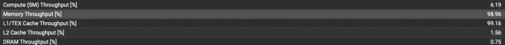
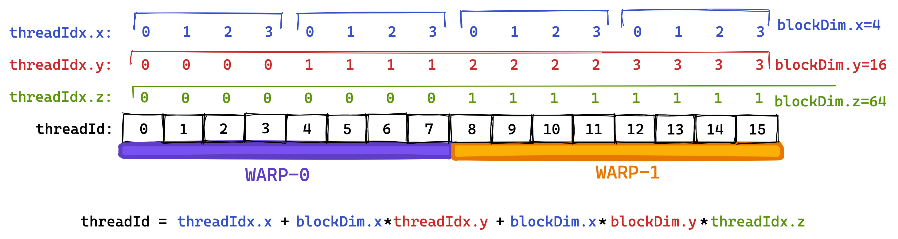
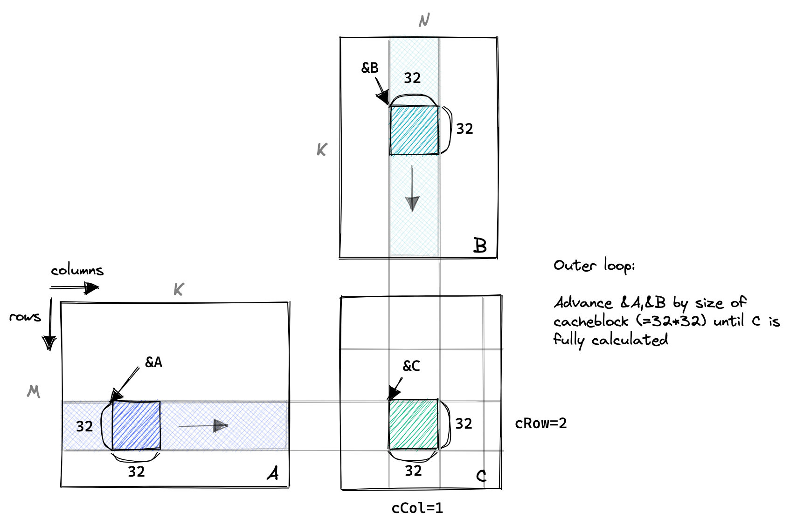
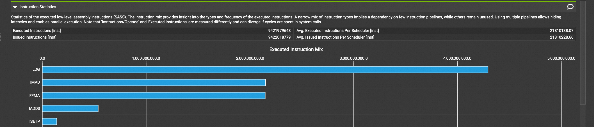
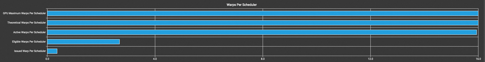
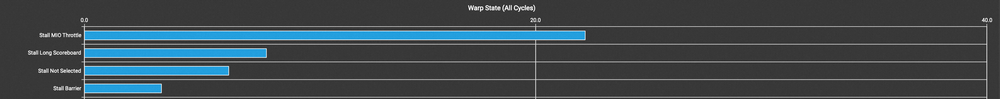
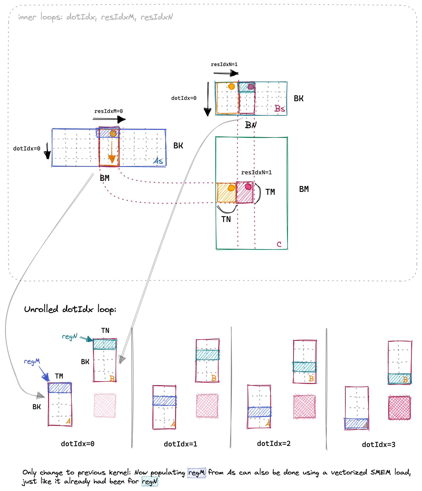

## 前言

首先，必须要认识到，把矩阵乘法优化到极致这件事情是一个非常非常难的事情，很多做芯片的搞体系结构的人都盯着这个方向。因此，作为一个初学者，我比如要想清楚自己到底为什么要做这个项目。我给自己定的小目标是以下三个：

1. 通过矩阵乘法的优化，大概了解GPU的基本架构，并能大概估计硬件层面的架构对于软件的性能到底会产生的影响。
2. 实现一个足够具有扩展性的实验架构，如果以后对于其他kernel的优化感兴趣，也能快速实验，对比不同实现的优劣。(提前给自己挖个坑，之后要去做Attention层的优化)
3. 学习 Nsight Compute 的使用，能够从 Profiling 工具中看出当前 kernel 的优化空间在哪里。

站在这个目的之上，我并不需要从头自己去实现，甚至我必须要多去抄一抄别人的实现, 然后思考他们为什么要这么实现。本文主要是翻译自 [siboehm的博客](https://siboehm.com/articles/22/CUDA-MMM), 他的图画的实在是太棒了, 非常的形象。我做了一些自己的补充，希望不是画蛇添足吧。

本文会从最简单的GEMM算子开始，一步一步优化，直到性能逼近cuBLAS库(Nvidia的官方库)中的`cublasSgemm`函数。首先介绍一下我们本次要解决的问题 SGEMM。数学上的定义如下；具体的，
$$
\begin{aligned}
&\boldsymbol{C} \leftarrow \alpha \boldsymbol{A} \boldsymbol{B}+\beta \boldsymbol{C} \\
&\boldsymbol{C} \in \mathbf{R}^{M \times N}, \boldsymbol{A} \in \mathbf{R}^{M \times K}, \boldsymbol{B} \in \mathbf{R}^{K \times N} \\
&c_{i, j} = \sum_{k=1}^K a_{i, k} b_{k, j}
\end{aligned}
$$

<!-- ## 程序架构

很遗憾，目前很多github实现并没有提供一个很好的框架。很多文章都会有一个图，表示不同矩阵大小之下自己的kernel与cublas的性能差异；但是他们的代码并不能直接得到时间结果。更有甚者，我直接将实现的kernel复制粘贴，调用得到的结果和cublas是有差异的，说明这个kernel要么实现的有问题，要么API实现的有问题导致我不知道怎么调用。

为了保证我们每次实现的kernel都是正确的，我们会随机生成A，B，C矩阵，并调用`cublasSgemm`函数，计算得到一个结果并保存在`cublas_output`中；对每个实现进行测速前，调用一次kernel，将其结果与`cublas_output`进行对比，完全一致之后再进行测速。测速时，调用40次kernel，最后对结果取平均值。由于CUDA kernel的launch是异步的，也就是说，CPU侧看到kernel函数返回并不意味着kernel函数调用结束了，因此不能再CPU侧计时，而需要使用`cudaEvent`进行计时；这一步是通用的，之后其他实验也会用到，因此将其封装在基类`BaseTest`中。 -->

## Naive Implementation

本小节从CUDA编程模型开始，介绍如何编写一个正确的GEMM kernel。在CUDA编程模型中，计算是一个三层的模型。每次调用CUDA kernel会生成一个grid，一个grid包含了多个block，每个block包含了至多1024个thread。我们编写的函数就是会运行在每个thread上。CUDA提供了一些变量来提供在这个全局的信息，例如一个block中thread的数量可以通过blockDim变量获得。这个变量包含了三个int值，代表了block每个维度上有几个thread。可以参考下图：


类似的，一个grid里block的个数也可以通过gridDim变量得到。在本章里，为了快速的实现一个正确的kernel，我们可以简单的认为一个block里不同的thread是等价的。在实现naive版本的时候，每个thread负责计算C中的一个元素。为了计算这个元素，我们需要load A中的一行和B中的一列。代码实现如下:

```C++
const uint x = blockIdx.x * blockDim.x + threadIdx.x;
const uint y = blockIdx.y * blockDim.y + threadIdx.y;
if (x < M && y < N>) {
  for (int i = 0; i < K; ++i) {
    tmp += A[x * K + i] * B[i * N + y];
  }
  // C = α*(A@B)+β*C
  C[x * N + y] = alpha * tmp + beta * C[x * N + y];
}
```

这个代码可以按照下图理解。每一个block负责计算图中紫色的部分，每个thread负责计算图中橙色的部分我们通过blockIdx和threadIdx来判断当前block的编号和thread的编号，进而唯一确定当前的threadId, 以此判断这个thread负责计算哪个部分。


下面我们分析GEMM代码的理论最优性能，以此判断我们的实现的优劣，以 M = N = K = 4096为例：

1. 计算量：$2 \times 4092^3 + 4092^2 = 137 \text{GFLOP}$。[A100 FP32的理论最优值](https://www.nvidia.com/content/dam/en-zz/Solutions/Data-Center/a100/pdf/nvidia-a100-datasheet-us-nvidia-1758950-r4-web.pdf)为 19.5TFLOPS。因此至少需要花7ms在计算上。
2. 至少需要读 $ 3 * 4092^2 * 4B = 201MB $数据，写 $4092^2 * 4B = 67MB$数据，A100 80GB的带宽是2039GB/s，因此至少需要花 268 / 1024 / 2039 = 0.1ms在访存上。注意这个值永远不可能达到，因为我们cache不够大，不可能塞下所有的数据，因此一定会有数据被重复读。

当前我们访存模式如下图所示。如果两个thread在一个block里，他们的threadIdx分别为(0, 0)和(1, 0), 它们会访问B中相同的一列，以及A中相邻的两行。每个thread需要读2\*4096个float，而我们有4096\*4096个thread, 一个我们需要从显存里读512GB的数据，这个数据是过高的估计，因为没有考虑上面相邻threadIdx其实只需要访问B一次。那哪怕是512GB的显存和2039GB/s的带宽，我们依然只需要250ms，但是而naive版本需要500ms，而实测cublas只需要8ms。


为了探究当前版本代码的瓶颈在哪里，我们使用如下命令进行profile。可以看到主要的问题是访存，因为内存带宽被打满了，而计算没有被打满。在compute compute里也会看到一个建议：目前一个线程为了访问4Byte的数据会导致传输528Byte的数据被传输，也就是说，我们没有达到最优解的原因是我们的访存效率只有1%。

```bash
ncu -o sgemm --set full --kernel-id ::sgemm_naive:6 sgemm
```



## Memory Coalescing

既然我们需要优化内存访问，我们首先需要了解英伟达GPU的基本架构。第一个需要了解的概念是Warp：在执行的时候，同一个block里的thread会被分组，每个组就是一个warp。GPU在运行的时候，会由 warp scheduler 来决定具体执行哪些指令，warp scheduler 会以 warp 为单位执行指令。初学者可以简单的理解为，一个warp里的线程总是会被同时执行且运行相同的代码。每个multiprocessor里会有4个warp scheduler。我们会按照threadId来划分warp，相邻的threadId会被划分到一个warp里去。对于每个thread，threadId都是唯一的。threadId的计算方式是`threadId = threadIdx.x+blockDim.x*(threadIdx.y+blockDim.y*threadIdx.z)`。下面的图就是一个warp的一个例子。为了简化图，下图中的warpsize等于8，实际warpsize的值是32。



GPU支持32B,64B,128B的访存请求。如果如果每个thread要访问1个float，且一个warp的多个thread访问的显存是连续的，且内存地址是对齐(aligned)的，那么他们的访存请求会被聚合成一个32*4B=128B的请求，这就是coalescing。下图就是连续显存的访存请求被聚合成一个请求的例子。每个warp发出的8个memory access request只用了两次32B的load。(译者注：这里可能是原作者的笔误，如果warpsize=8, 每个thread访问4Byte的数据，可以被聚合成一个32B的请求而不是两个。但是不影响读者理解，图只是辅助，没必要抠细节)


回忆naive kernel的访存模式，(0, 0), (0, 1)在一个warp里，但是去会去访问A中的不同行，不同行的数据并不是连续的。global没法一次就取回所有的数据，所以一个warp每次都需要进行很多次访存。因此naive kernel访问A的方式就像下图一样混乱。(译者注：在4096的GEMM例子里，8个thread要访问的地址应该差的很远，因此会需要8个memory access)


既然知道了这个，我们的思路就很清晰了，我们要让一个warp里的不同的thread访问相邻的数据。下图是我们想实现的coalescing kernel和naive kernel访存模式的对比图。在coalescing kernel里，对A的访问可以通过broadcast实现，对B的访问可以实现聚合。


这个kernel的改动非常简单，只需要修改前两行。而这个简单的优化会让整个程序的性能从500ms降低到52ms。

```python
const int x = blockIdx.x * BLOCKSIZE + (threadIdx.x / BLOCKSIZE);
const int y = blockIdx.y * BLOCKSIZE + (threadIdx.x % BLOCKSIZE);
```

至此，我们走完了一个完整的优化流程：1. profiling 2. 分析当前瓶颈 3. 优化。之后我们会重复这个步骤，直到我们满意为止。

## Shared Memory/BlockTiling

上一个kernel的profile结果显示，L2 Cache的命中率只有10%。这个是我们本章要优化的重点。现在我们就需要了解一下A100的内存架构了(下图来自[这里](https://developer.nvidia.com/blog/cuda-refresher-cuda-programming-model/)): 所有的block逻辑上共享一个L2 Cache，亦或是一个shared memory。当然虽然逻辑上共享，但其实每个block访问的是自己的shared memory。A100机器中，每个block可以访问42KB的shared memory。shared memory是在芯片上的，因此相比global memory，它有更小的时延和更高的带宽。(siboehm和我都没有找到Ampere架构的shared memory带宽，但是[这篇论文](https://arxiv.org/abs/1804.06826)的实现表明Volta上global memory的带宽是750GB/s，shared memory的带宽是12080GB/s，二者差了16倍！)


下图是整个系列中至关重要的一个抽象。一个block完成了C矩阵中的一个子矩阵的计算。为了完成这个子矩阵的计算，这个block需要从A中load好几行，从B中load好几列。既然一个block里的不同thread会用到相同的数据，那我们就先让不同的thread将数据从global memory加载到 shared memory中，然后每个thread再各自从shared memory中load数据。这样就可以有效提高shared memory的cache命中率。在下图中，每次先load 矩阵A和B的一部分，称之为blockTile，然后用这些数据计算，得到中间结果。



下面是优化后kernel的核心代码。`__syncthreads()`会阻塞线程直到一个block里所有的thread都执行完毕。这里我们必须保证计算和访存不可以交叠，否则计算的时候拿到的可能是错误的数据！

```c++
// 外层循环是对block的迭代。
for (int bkIdx = 0; bkIdx < K; bkIdx += BK) {
    // load block from global memory into shared memory
    for(int i = 0; i < BM; i += strideA) {
      As[innerRowA + i][innerColA] = A[(innerRowA + i) * K + innerColA];
    }
    for(int i = 0; i < BK; i += strideB) {
      Bs[innerRowB + i][innerColB] = B[(innerRowB + i) * N + innerColB];
    }
    __syncthreads();
    A += BK;
    B += BK * N;
    // execute the dotProduct on the cached block
    for (int dotIdx = 0; dotIdx < BK; ++dotIdx) {
      tmp += As[threadX][dotIdx] * Bs[dotIdx][threadY];
    }
    __syncthreads();
  }
```

优化之后，时延从52ms降到了31ms。

## ThreadTiling

但是，cublas的时延是8.8ms。我们距离cublas还有很长的路。查看Nsight Compute的时候看到了两个warning。第一个显示Eligible Warps的数量不够多，导致机器空闲的时候warp scheduler没有warp可以去调度。第二个图显示了大部分thread被阻止的原因是 Stall MIO Throttle(详情可以参考这里[Kernel Profiling Guide](https://docs.nvidia.com/nsight-compute/ProfilingGuide/index.html#metrics-reference))，意思就是，Warp因为等待Memory IO所以处于stall状态无法执行。这里提到的stall原因可能有special math instructions, dynamic branches, shared memory instructions。考虑我们的代码只有shared memory的访存，因此得到结论，我们大部分时间在等待shared memory的访存。另外查看执行执行的类型，发现大部分指令都是LD(下图三)指令，我们也可以通过Godbolt来查看编译后得到的指令，确实循环里load指令多于fma指令，同时我们知道访存比计算慢得多。综上，我们可以得出结论：当前kernel的问题是运行时大部分时间都在等待访存结果。





基于此，我们引入theadTiling，其目标在于让计算掩盖访存开销。每个thread负责计算TM\*TN个元素，也就是一个threadTile，先将A和B的blockTile load到shared memory中，然后每次再将shared memory中的blockTile load到寄存器数组中。最后利用寄存里数组里的数据计算一个threadTile的结果。


```c++
float threadResults[TM][TN] = {0.0};
// register caches for As and Bs
float regM[TM] = {0.0};
float regN[TN] = {0.0};
...
for (uint dotIdx = 0; dotIdx < BK; ++dotIdx) {
    // load block into registers
    for (uint i = 0; i < TM; ++i) {
        regM[i] = As[threadRow * TM + i][dotIdx];
    }
    for (uint i = 0; i < TN; ++i) {
        regN[i] = Bs[dotIdx][threadCol * TN + i];
    }
    for (uint resIdxM = 0; resIdxM < TM; ++resIdxM) {
        for (uint resIdxN = 0; resIdxN < TN; ++resIdxN) {
            threadResults[resIdxM][resIdxN] +=
                regM[resIdxM] * regN[resIdxN];
        }
    }
}
```

原作者为了让我们理解dotIdx这个loop究竟在做什么还贴心的画了下面这张图，向我们展示了这个循环的目的就是遍历As和Bs里的所有的数据。


通过tiling，我们将时延从31ms提升到了11ms。至此，我们当前的程序结构如下图所示：


## Transpose As & Vertorize

一个很直接想法是，是不是可以通过对As进行转置。这样每次load shared memory的时候访问的都是连续的地址空间。(作者声称可以通过这个优化实现3%的提升，原因是之前LD32指令变成了LD128指令。但是译者用Godbolt编译之后发现不转置用的就是LD128，怪事。)



之后我们考虑使用vector数据结构，也就是float4, 核心代码如下，其效果是将原来的ld.global.f32编程了ld.global.v4.f32指令，本质上也是将LD32变成了LD128。原作者一开始觉得编译器就应该自动优化global memory的访存，后来他意识到global memory的访存不一定满足aligned这个条件，所以编译器不会自动优化。而shared memory编译器是可以保证aligned的，因此会自动优化。

```C++
float4 tmp =
    reinterpret_cast<float4 *>(&A[innerRowA * K + innerColA * 4])[0];
As[(innerColA * 4 + 0)][innerRowA] = tmp.x;
As[(innerColA * 4 + 1)][innerRowA] = tmp.y;
As[(innerColA * 4 + 2)][innerRowA] = tmp.z;
As[(innerColA * 4 + 3)][innerRowA] = tmp.w;

reinterpret_cast<float4 *>(&Bs[innerRowB][innerColB * 4])[0] =
    reinterpret_cast<float4 *>(&B[innerRowB * N + innerColB * 4])[0];
__syncthreads();
```

这个指令可以做到13.3TFLOPS, 延时到了10.3ms，降低了1ms。

## Double Buffering

译者参考[kunkun的代码]先实现了double buffering。因为实测原作者实现的double buffering并没有取得收益。因为在实现 double buffering 的过程中，我们会把代码拆解成不同的部分。double buffering 的本质是用计算来掩盖内存加载开销。

```c++
load(block)
do {
  if (block->next) {
    load(block->next);
  }
  compute(block);
} while((block = block->next)!=nullptr)
```

1. 我们会将load blockTile into shared memory拆解成两步，第一步是load blockTile到register，第二步是load blockTile到shared memory。只有第二步需要访问 shared memory，因此只有第二步之后才需要进行__syncthreads。这么做相当于拆分的粒度更细了。
2. 既然shared memory的访存可以被掩盖，register的访存开销也可以被掩盖。因此我们一步到位，直接对shared memory和register数组都使用double buffering。

伪代码如下。优化后的时延是9.4ms。拼死拼活就优化了1ms。

```c++
// load first block tile
loadBlockTileFromGlobalMemoryIntoSharedMemory(A, B, As, Bs, ldg_A_reg, 0/*write_stage_idx*/);
__syncthreads();
// load first thread tile for current block
loadThreadTile(As, Bs, regA, regB, 0/*dotIdx*/, 0/*load_stage_idx*/);
int write_stage_idx = 1, tile_idx = 0;
do {
  tile_idx += BK;
  if (tile_idx < K) {
    // load next block tile - first step
    loadBlockTileFromGlobalMemoryIntoRegister(A, B, ldg_A_reg, ldg_B_reg, tile_idx);
  }
  int load_stage_idx = write_stage_idx ^ 1;
  #pragma unroll
  for (uint dotIdx = 0; dotIdx < BK-1; ++dotIdx) {
    // load next thread tile from current block
    loadThreadTile(As, Bs, regA, regB, dotIdx+1, load_stage_idx);
    // compute current thread tile
    computeThreadTile(regA, regB, threadResults, dotIdx);
  }

  if(tile_idx < K){
    // load next block tile - second step
    loadBlockTileFromRegisterIntoSharedMemory(ldg_A_reg, ldg_B_reg, As, Bs, write_stage_idx);
    __syncthreads();
    write_stage_idx ^= 1;
  }

  // load first thread tile
  loadThreadTile(As, Bs, regA, regB, 0/*dotIdx*/, load_stage_idx^1);
  // compute the last thread tile of the current block
  computeThreadTile(regA, regB, threadResults, 1/*dotIdx*/);
} while (tile_idx < K);
```

## Warp Tiling

最后一个优化，是在blockTile和threadTile之间引入warp。更细粒度的决定每个warp的行为。每个thread负责计算一个TM\*TN的小矩阵，每个warp则负责计算WM\*WN的矩阵。因为warp是调度的基本单位，warp tiling方便我们之后来看bank conflicts(本文不会涉及); 同时warpTiling可以更好地提升局部性，提升cache命中率。


在我们之前的代码中，只有`computeThreadTile` 和 `loadThreadTile` 的逻辑需要改变。原来一个thread只负责一个threadTile，现在负责多个threadTile, 因此需要引入额外的循环来处理warp层面的tile。

```c++
for (uint wSubRowIdx = 0; wSubRowIdx < WMITER; ++wSubRowIdx) {
  for (uint i = 0; i < TM; ++i) {
    regM[wSubRowIdx * TM + i] =
        As[(dotIdx * BM) + warpRow * WM + wSubRowIdx * WSUBM +
            threadRowInWarp * TM + i];
  }
}
for (uint wSubColIdx = 0; wSubColIdx < WNITER; ++wSubColIdx) {
  for (uint i = 0; i < TN; ++i) {
    regN[wSubColIdx * TN + i] =
        Bs[(dotIdx * BN) + warpCol * WN + wSubColIdx * WSUBN +
            threadColInWarp * TN + i];
  }
}

void computeTile(
  const float* regA, const float* regB, float* threadResults, const int dotIdx) {
  #pragma unroll
  for (uint wSubRowIdx = 0; wSubRowIdx < WMITER; ++wSubRowIdx) {
    #pragma unroll
    for (uint wSubColIdx = 0; wSubColIdx < WNITER; ++wSubColIdx) {
      // calculate per-tile results
      for (uint resIdxM = 0; resIdxM < TM; ++resIdxM) {
        for (uint resIdxN = 0; resIdxN < TN; ++resIdxN) {
          Val4D(threadResults, wSubRowIdx, resIdxM, wSubColIdx, resIdxN, TM, WNITER, TN) +=
              Val3D(regA, dotIdx%2, wSubRowIdx, resIdxM, WMITER, TM) * 
              Val3D(regB, dotIdx%2, wSubColIdx, resIdxN, WNITER, TN);
        }
      }
    }
  }
}
```

warptiling 最终能达到14.9TFLOPS，达到了cublas的96%的性能，延时到了9.19ms。

## 结束语

到此为止了。从profiling的角度看，目前L1 cache 的命中率很低，可以考虑优化一下；从看博客的角度看，bank conflicting我也还没优化；恐怕再往后再去优化就要写汇编代码了，我也就不深入去搞这个了，毕竟各位读者不会给我打钱。另外，现在还没有使用tensor core，之后会再找一个机会学习tensor core。在我快写完这个博客的时候，美国出了新的禁令，禁止了中国公司购买A100，说不定新的芯片里tensor core已经没有了。这大概也是上天给的信号，这次项目就到此为止吧。

第一次接触GEMM是之前在UCLA上一门课的时候，这个是那门课的project，那个时候还没毕业，可以静下心来好好学习CUDA，写了很多不规范的乱七八糟的代码，没有认真调研，优秀的博客也是一目十行的度过，也没认认真真写完这个博客；现在上班了，被各种事情弄得焦头烂额，却努力挤出时间写完了这个。写这个博客的时候，有一瞬间仿佛回到了加州，那个时候还有大把大把的时间可以挥霍，所以文中经常提到我马上就要去学flash attention，大概就是我处于学生时间的不切实际的幻想。但是我也真心希望之后真的能抽出时间学习自己想学的东西，永远都能做自己想做的事情。
